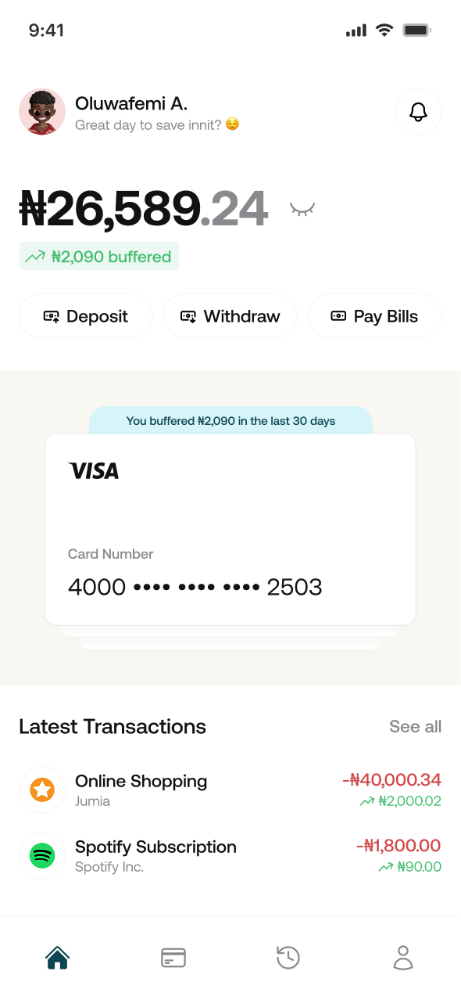
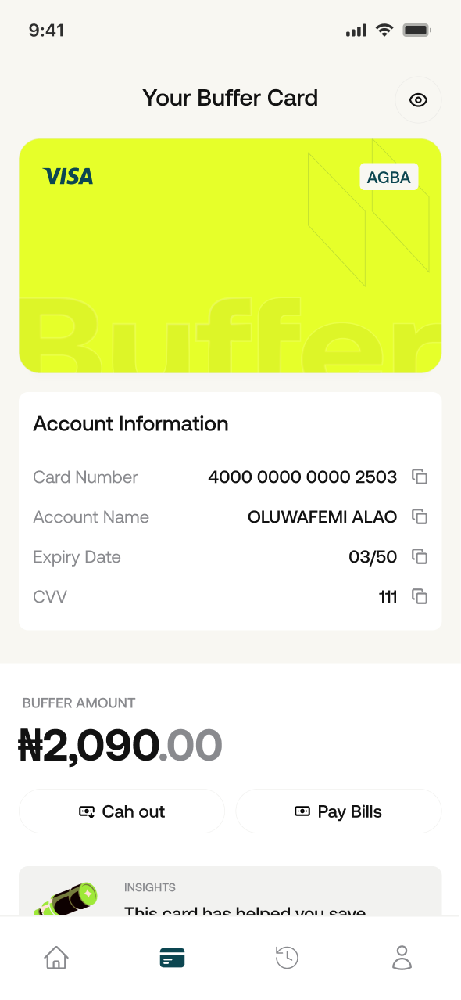
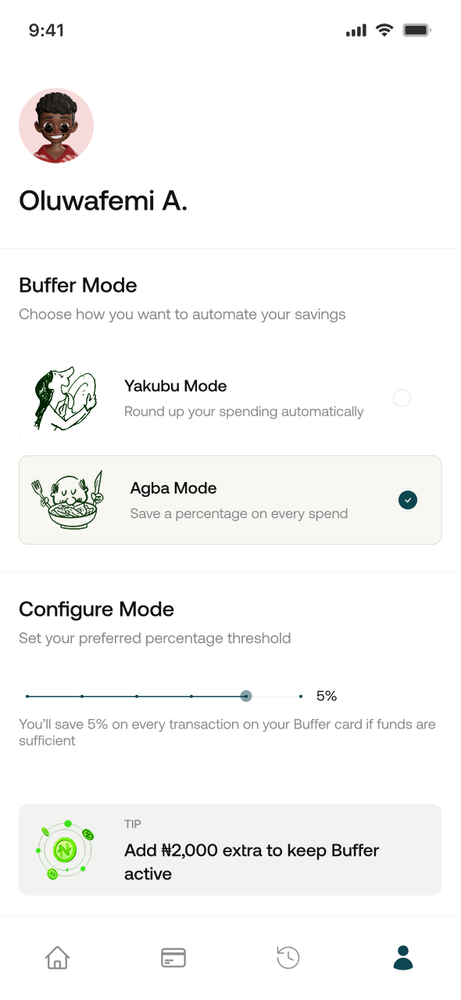

# Buffer


**Spend normally. Save automatically.**

Buffer is a financial automation app that puts saving inside everyday spending.

Each time a user spends, Buffer automatically moves a small amount into a separate cushion so users build a rainy-day buffer without changing how they already transact.

## At a Glance

- What it is: a virtual card + wallet experience that saves automatically when users spend
- Why it matters: it helps users build emergency protection passively
- Frontend: React Native, Expo, TypeScript
- Backend: Node.js, Express, Prisma, PostgreSQL
- API: [https://buffer-0sox.onrender.com](https://buffer-0sox.onrender.com)
- Swagger: [https://buffer-0sox.onrender.com/api-docs](https://buffer-0sox.onrender.com/api-docs)
- Figma: [Design](https://www.figma.com/design/lBYn98UohALuIY08CWV4lt/Buffer?node-id=0-1&t=66lB5HAfJgTECPWj-1) | [Prototype](https://www.figma.com/proto/lBYn98UohALuIY08CWV4lt/Buffer?node-id=16-82&p=f&viewport=377%2C241%2C0.14&t=yrydQ7j4ukLQFu41-1&scaling=contain&content-scaling=fixed&starting-point-node-id=16%3A82&page-id=0%3A1)

## Quick Start

Requirements:

- Node.js `18+`
- npm
- Android Studio emulator or iOS Simulator for mobile testing
- PostgreSQL for the backend

### Mobile App

```bash
cd mobile
npm install
npx expo start
```

- Press `a` for Android
- Press `i` for iOS
- Run `npm run web` for web preview

### Backend API

Create `backend/.env` with:

```env
DATABASE_URL=your_postgres_connection_string
JWT_SECRET=your_secret
PORT=3000
INTERSWITCH_CLIENT_ID=your_client_id
INTERSWITCH_CLIENT_SECRET=your_client_secret
INTERSWITCH_BASE_URL=https://sandbox.interswitchng.com
```

Then run:

```bash
cd backend
npm install
npx prisma generate
npm run dev
```

## The Problem

The problem is not that people do not want to save.

The problem is that everyday spending rarely builds any protection for emergencies.

In Nigeria, payment access is improving, but financial resilience is still weak. According to EFInA's 2023 financial health data:

- only `16%` of Nigerian adults were financially healthy
- `84%` ran out of money at least once
- `78%` could not raise emergency funds within a week

That is the gap Buffer is built for.

People already spend every day. What is missing is a system that quietly turns those daily transactions into something useful for rainy days.

Research: [EFInA - Beyond Access: Putting Financial Health at the Core of Nigeria's Next Inclusion Strategy](https://efina.org.ng/wp-content/uploads/2025/09/Beyond-Access-Why-Financial-Health-Must-Be-Nigerias-Next-Inclusion-Goal.pdf)

## The Solution

Buffer puts savings inside everyday spending.

Every time a user spends, Buffer automatically moves a small amount into a separate cushion.

So instead of relying on leftover money or saving habits, users build emergency protection as they transact normally.

## How Buffer Works

1. User signs up, completes onboarding, and gets a virtual spending card.
2. User funds the main wallet and spends normally.
3. Buffer automatically saves on each transaction using one of two modes:
   AGBA: save a percentage of every transaction (`1% - 5%`)
   Yakubu: round up to a chosen threshold such as `₦50`, `₦100`, or `₦500`
4. Savings move into the Cushion Wallet and stay available for rainy days.
5. Users can withdraw cushion funds or use them for supported payments.

## Core Logic

- If balance covers purchase + savings, both happen.
- If balance covers only the purchase, the transaction can still go through and savings may be skipped.
- If balance cannot cover the purchase, the transaction is declined.

**Buffer makes saving automatic without blocking spending.**

## Product Screens

| Home                              | Card                               |
| --------------------------------- | ---------------------------------- |
|  |  |

| Transactions                                                | Settings                                   |
| ----------------------------------------------------------- | ------------------------------------------ |
|  |  |

## Tech Stack

### Mobile

- React Native
- Expo
- TypeScript
- React Navigation
- Redux Toolkit

### Backend

- Node.js
- Express
- TypeScript
- Prisma ORM
- PostgreSQL
- Swagger / OpenAPI
- Zod

### Integrations

- Interswitch sandbox integration through the backend
- Identity verification flow for onboarding
- Cushion withdrawal and bill payment flows

## Project Structure

```text
buffer/
├── mobile/        # Expo React Native app
├── backend/       # Express + Prisma API
├── design/        # Product UI screens
├── deck/          # Pitch deck slides
├── cover.png
└── README.md
```

## Key Backend Capabilities

- Authentication: `/auth/register`, `/auth/login`
- User setup and profile updates: `/user`
- Wallet funding and balance flows: `/wallet`
- Spending and transaction records: `/transactions`
- Cushion management: `/cushion`
- Virtual card management: `/card`
- Transfers: `/transfers`

## Resources

- Figma Design: [Buffer Design](https://www.figma.com/design/lBYn98UohALuIY08CWV4lt/Buffer?node-id=0-1&t=66lB5HAfJgTECPWj-1)
- Figma Prototype: [Buffer Prototype](https://www.figma.com/proto/lBYn98UohALuIY08CWV4lt/Buffer?node-id=16-82&p=f&viewport=377%2C241%2C0.14&t=yrydQ7j4ukLQFu41-1&scaling=contain&content-scaling=fixed&starting-point-node-id=16%3A82&page-id=0%3A1)
- Pitch Deck Assets: [`deck/`](deck/)
- Swagger Docs: [https://buffer-0sox.onrender.com/api-docs](https://buffer-0sox.onrender.com/api-docs)

## Team

This project was built as a hackathon collaboration across product, design, frontend, and backend.

- Frontend: React Native / Expo
- Backend: API and integrations
- Design: UI/UX and prototype


# Buffer Backend

Backend API for Buffer, a fintech savings and cushion-wallet experience built for demo and hackathon submission.

## Live Links

- Base API: `https://buffer-0sox.onrender.com`
- Swagger docs: `https://buffer-0sox.onrender.com/api-docs`
- Health check: `https://buffer-0sox.onrender.com/health`

## Interswitch Integration

Buffer uses Interswitch through the backend in sandbox mode.

The mobile app does not call Interswitch directly and does not store Interswitch credentials. Instead, the app talks to the Buffer backend, and the backend owns the Interswitch token flow and provider requests.

Current Interswitch-connected capabilities in the backend:

- OAuth token generation with `INTERSWITCH_CLIENT_ID` and `INTERSWITCH_CLIENT_SECRET`
- Receiving institutions lookup for bank lists
- Customer lookup for account-name resolution
- Payout initiation for bank transfers
- Payout status checks
- Payment authorization used by transaction simulation
- Bill payment initiation

Current product behavior:

- Core app flows remain usable even when provider-side calls are unstable
- Some frontend flows use local fallback logic to preserve demo reliability
- This means the app experience stays smooth, while the backend integration points for Interswitch are still present and documented

In short:

- Frontend: talks to Buffer backend
- Backend: talks to Interswitch sandbox APIs
- Demo reliability: protected with fallback behavior where needed

## What This Backend Supports

- User registration and login with JWT authentication
- Profile, KYC verification, and savings settings management
- Main wallet funding and balance retrieval
- Cushion wallet balance, bill payment, withdrawal, and move-to-main flow
- Simulated card payments with automated savings round-up logic
- Virtual card creation, freeze, and unfreeze
- Bank listing, account resolution, and send-money transfer flow
- Transaction history and ledger-backed balance updates

## Interswitch Services Used

The backend is currently wired around these Interswitch service categories:

- Authentication / OAuth token flow
- Receiving Institutions
- Customer Lookup
- Payouts
- Payments
- Bills Payments

These integrations live in:

- [backend/src/modules/interswitch/interswitch.service.ts](backend/src/modules/interswitch/interswitch.service.ts)
- [backend/src/modules/transfers/transfer.service.ts](backend/src/modules/transfers/transfer.service.ts)
- [backend/src/modules/transaction/transaction.service.ts](backend/src/modules/transaction/transaction.service.ts)
- [backend/src/modules/cushion/cushion.service.ts](backend/src/modules/cushion/cushion.service.ts)

## Stack

- Node.js
- TypeScript
- Express
- Prisma
- PostgreSQL
- Swagger / OpenAPI

## Local Setup

1. Install dependencies:

```bash
npm install
```

2. Copy environment variables:

```bash
cp .env.example .env
```

3. Update `DATABASE_URL` in `.env` to point to a running PostgreSQL database.

4. Generate the Prisma client and run migrations:

```bash
npx prisma generate
npx prisma migrate deploy
```

5. Start the API locally:

```bash
npm run dev
```

Local Swagger docs will be available at `http://localhost:3000/api-docs` unless you change `PORT`.

## Environment Variables

See [.env.example](/home/malik/Documents/tecmalik/buffer/backend/.env.example) for the full template.

- `PORT`: API port
- `DATABASE_URL`: PostgreSQL connection string
- `JWT_SECRET`: signing secret for auth tokens
- `JWT_EXPIRES_IN`: token lifetime
- `SALT_ROUNDS`: bcrypt cost factor
- `INTERSWITCH_BASE_URL`: Interswitch sandbox base URL
- `INTERSWITCH_CLIENT_ID`: mock/sandbox provider client id
- `INTERSWITCH_CLIENT_SECRET`: mock/sandbox provider client secret
- `INTERSWITCH_CURRENCY`: transfer currency, default `NGN`

## Interswitch Integration Notes

- The Interswitch client lives in [src/modules/interswitch/interswitch.service.ts](/home/malik/Documents/tecmalik/buffer/backend/src/modules/interswitch/interswitch.service.ts).
- `INTERSWITCH_CURRENCY` should remain `NGN`; kobo is the amount unit, not a separate currency code.
- Transfers use Interswitch institution lookup, account resolution, payout initiation, and payout status endpoints.
- Cushion bill payments and payout withdrawals are routed through the same integration layer.
- Transaction payment simulation calls the Interswitch payment authorization flow.
- Virtual card issuance itself is still mocked in the current backend, but card-driven transaction authorization is routed through the Interswitch client.
- This backend currently accepts user-facing amounts in naira and converts them to kobo before sending requests to Interswitch.

## Demo Flow

For a clean end-to-end demo, this sequence matches the available API:

1. Register a user with `POST /auth/register`
2. Login with `POST /auth/login`
3. Set a transaction PIN with `POST /user/set-transaction-pin`
4. Fund the wallet with `POST /wallet/fund`
5. Update savings mode with `PUT /user/settings`
6. Trigger a round-up via `POST /transactions/pay`
7. Show cushion balance with `GET /cushion`
8. Move funds back or withdraw using `POST /cushion/move-to-main` or `POST /cushion/withdraw`
9. Show transfers with `POST /transfers/send` after resolving an account if needed
10. Show transaction history with `GET /transactions`

For the demo narrative, explicitly call out that steps 6, 8, and 9 are the strongest Interswitch-backed moments because they touch payment authorization, bill payment, and payouts.

## Demo Credentials

This repo does not include seeded login credentials by default. For the demo, either:

- create a fresh account through `POST /auth/register`, or
- add your shared demo account details to the main submitted GitHub README if your team is using a pre-created account
