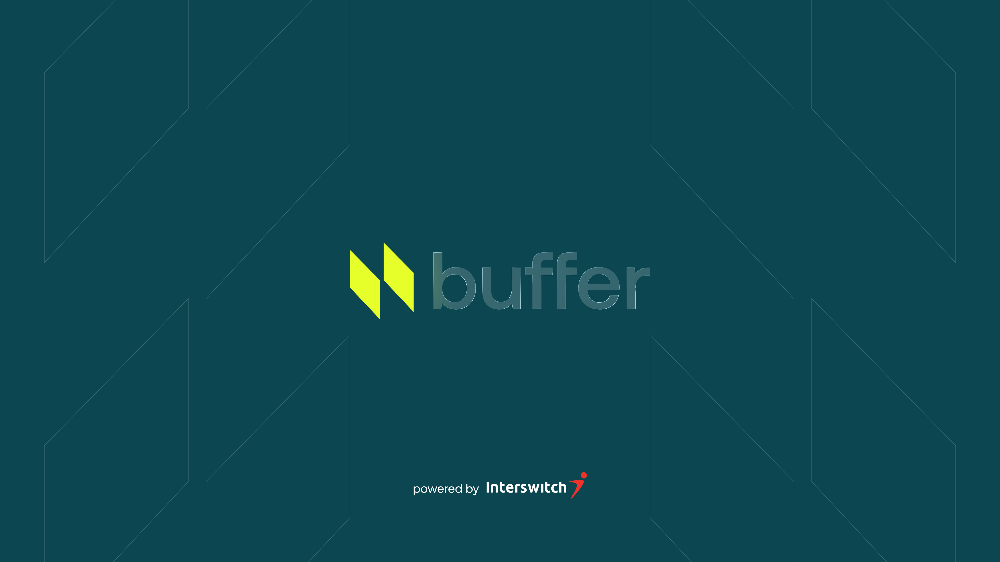

# Buffer

**Buffer** is a financial automation app that turns everyday spending into a cushion you can rely on.

Users spend as they normally would with a **Virtual Spending Card**, and Buffer moves small amounts (based on user settings) aside into a **Cushion Wallet**. These micro-savings grow over time without requiring users to change their behavior. Funds in the Cushion Wallet can be withdrawn anytime or used instantly for essential payments like electricity.

[Figma Design](https://www.figma.com/design/lBYn98UohALuIY08CWV4lt/Buffer?node-id=0-1&t=66lB5HAfJgTECPWj-1)

[Figma Prototype](https://www.figma.com/proto/lBYn98UohALuIY08CWV4lt/Buffer?node-id=16-82&p=f&viewport=377%2C241%2C0.14&t=yrydQ7j4ukLQFu41-1&scaling=contain&content-scaling=fixed&starting-point-node-id=16%3A82&page-id=0%3A1)

## Problem Statement

In Nigeria, small amounts of money (₦5–₦50) are often ignored during daily spending, but over time they are used in impulse purchases. Situations where:

- Subscription payments or utilities require big sums of money.
- Emergency or unplanned expenses catch them unprepared.

**Buffer solves this problem** by automatically accumulating small amounts from everyday spending into a dedicated reserve, creating a **ready-to-use financial cushion**.

## Core Concept

1. **Virtual Spending Card** – powered by Interswitch Card360 API.
2. **Automated Micro-Savings** – based on transaction amounts and mode selected by the user, moved to the Buffer Wallet.
3. **Buffer Wallet (Safety Net)** – showing total saved, available for withdrawal or instant payments.
4. **Two Saving Modes**:
   - **AGBA Mode** – Percentage-based saving (1–5%) of each transaction.
   - **Yakubu Mode** – Round-up saving (nearest ₦50, ₦100, or ₦500) per transaction.

## Technical Implementation

**Frontend:** React Native / Expo

- Screens: Onboarding, Dashboard, Card, Transaction, Settings
- Services: `API calls` (Card360, BillPay, Identity)
- Hooks / utils: Cushion calculations, notifications

**Backend:** Node, Express

- Routes for transactions, balance, user management
- Integrates with Interswitch APIs

### API Integration Points

| API                  | Purpose                                                  |
| -------------------- | -------------------------------------------------------- |
| Interswitch Card360  | Issue/manage virtual spending card                       |
| Interswitch BillPay  | Pay utilities, airtime, healthcare directly from Cushion |
| Interswitch Identity | BVN/NIN verification for KYC                             |
| DB                   | Ledger and user data storage                             |
